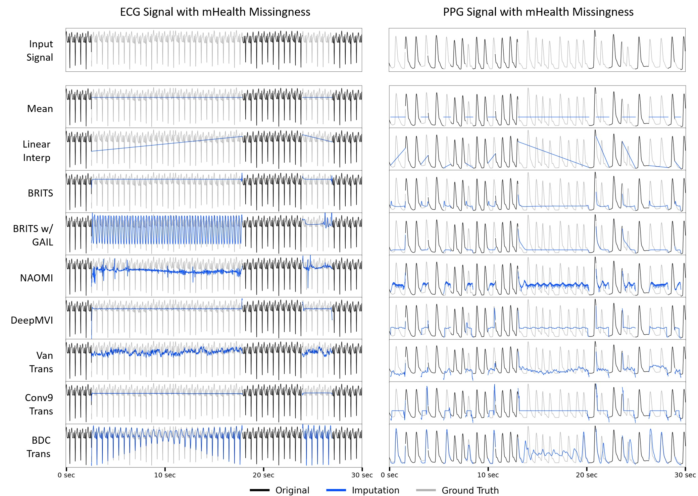
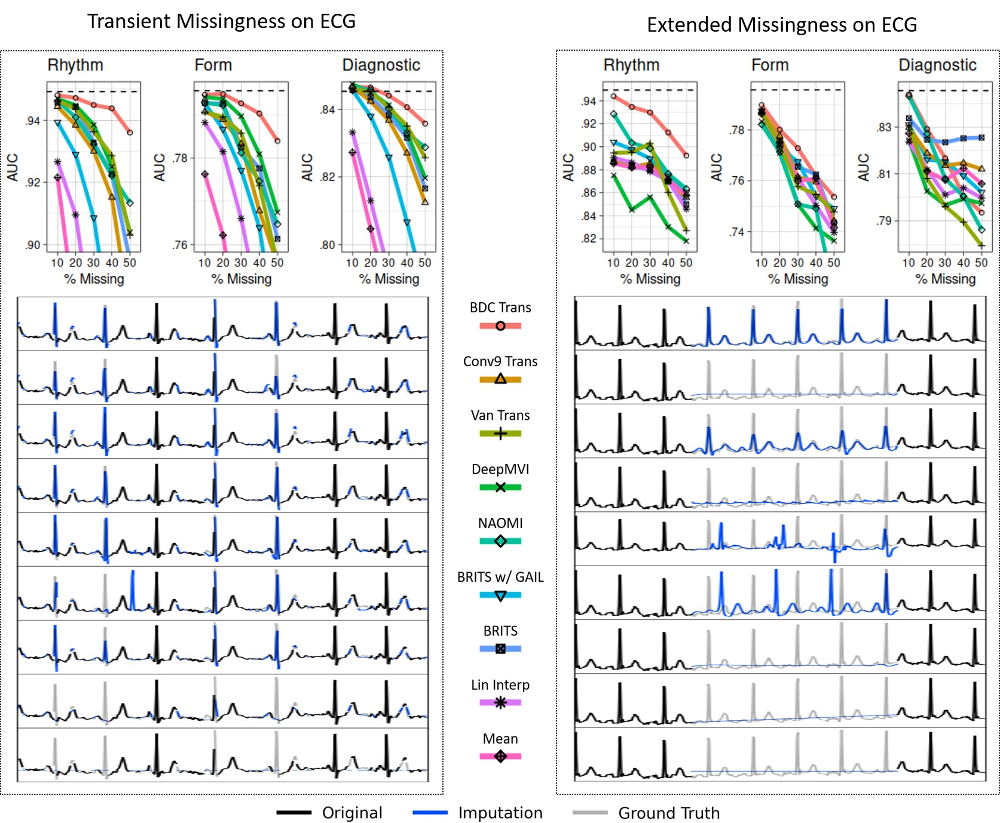

# PulseImpute Challenge


This is a repository containing PyTorch code for PulseImpute: A Novel Benchmark Task for Physiological Signal Imputation (Presented at the 2022 NeurIPS Dataset & Benchmarks Track). You can find our key visualizations from the paper as well as instructions for for testing pre-trained models in the paper and training your own models in the instructions below.

Please read our paper on arxiv here: https://arxiv.org/abs/2212.07514

<p align="center">
 
</p>
<p> Visualization of imputation results from six baseline methods on representative ECG and PPG signals. The large temporal gaps which arise from real-world missingness patterns create substantial challenges for all methods. For example, methods such as BRITS and DeepMVI produce nearly constant outputs, while GAN-based approaches (BRITS w/ GAIL and NAOMI) hallucinate incorrect structures in incorrect locations. Our novel BDC Transformer architecture also struggles in the middle of long gaps. </p>

<br>
<p align="center">

</p>
<p> Cardiac Classification in ECG Results for Transient and Extended Loss on Rhythm, Form, and Diagnosis label groups. For each label group, a cardiac classifier was trained and tested on complete data (test performance illustrated by dashed line). The trained model was then evaluated on imputed test data (for five levels of missingness from 10% to 50%) produced by each baseline, yielding the AUC curves (top). Representative imputation results for the 30% missingness test case are plotted (below). The Extended Loss setting proved to be more challenging for all methods. </p>

-----


## Setup 

### Installing dependencies

For this project we use [miniconda](https://docs.conda.io/en/latest/miniconda.html) to manage dependencies. After setting it up, you can install the pulseimpute environment:

    conda env create -f pulseimpute.yml
    conda activate pulseimpute


### Downloading data

Download our extracted mHealth ECG/PPG missingness patterns and curated datasets (MIMIC-III ECG/PPG Waveform and PTB-XL) via the follwing bash-script:

    bash ./get_data.sh

This script downloads and extracts the ECG missingness patterns (missing_ecg_{train/val/test}.csv)), PPG missingness patterns (missing_ppg_{train/val/test}.csv)), MIMIC-III ECG data (mimic_ecg_{train/val/test}.npy)), MIMIC-III PPG data (mimic_ppg_{train/val/test}.npy)), and PTB-XL ECG data (ptbxl_ecg.npy)) from the data hosted [here](https://www.dropbox.com/sh/6bygnzzx5t970yx/AAAHsVu9WeVXdQ_c1uBy_WkAa?dl=0) (469.8 MB compressed and 91.5 GB uncompressed). They can also be accessed via a persistent dereferenceable identifier at www.doi.org/10.5281/zenodo.7129965

## Obtaining Trained Models

### Get Pre-trained Checkpoints

Download our pre-trained checkpoints and imputed waveforms for each benchmarked models (BDC Transformer, Conv9 Transformer, Vanilla Transformer, DeepMVI, NAOMI, BRITS w/ GAIL, BRITS) for each PulseImpute task (ECG Heart Beat Detection, PPG Heart Beat Detection, ECG Cardiac Pathophysiology Classification) via the following bash script from the ckpts hosted [here](https://www.dropbox.com/sh/u4b7hq98acu7ssj/AADB_9ZrTAHe9hCAmN2Hbdnra?dl=0). 

    ./get_ckpts.sh

### or Re-train from Scratch

Simply find the config of the model to be trained in their respective config file (e.g. configs/train_transformer_configs.py,  configs/train_brits_configs.py,  configs/train_naomi_configs.py) and in train_imp.py, set the config to that dictionary name to retrain each model from scratch.

    python train_imp.py

### Training your own custom model
Create the desired model class by following the example shown in models/tutorial/tutorial.py. The training and test methods for this tutorial model are in models/tutorial_model.py. Create a corresponding config entry in configs/train_tutorial_configs.py and run the training script train_imp.py with this config.      


## Evaluate Trained Models on Test Set with Downstream Tasks

Simply find the config of the model to be tested in their respective config file (e.g. configs/test_transformer_configs.py,  configs/test_brits_configs.py,  configs/test_naomi_configs.py) and in train_imp.py, set the config to that dictionary name to run the imputation model on the test set.

    python test_imp.py

-----

## Demo:
We have created an interactive Google colab notebook that can be used to view the imputations of different models. No additional training or code running is required; the notebook can be run out of the box on a Jupyter environment.

Click play at the bottom left on the video below to watch a demo of the notebook:

https://github.com/rehg-lab/pulseimpute/assets/70555752/49b383bd-79f7-4581-b009-a814373cfa5f


Explore the visualizations here!

Visualize model imputations &ensp; [](https://colab.research.google.com/drive/1rltEUl-gHDww3GsMcfFxVBGC_mgfIqlF?usp=sharing)


-----

If you use our work in your research, please cite
```bibtex
@article{xu2022pulseimpute,
  title={PulseImpute: A Novel Benchmark Task for Pulsative Physiological Signal Imputation},
  author={Xu, Maxwell and Moreno, Alexander and Nagesh, Supriya and Aydemir, Varol and Wetter, David and Kumar, Santosh and Rehg, James M},
  journal={Advances in Neural Information Processing Systems},
  volume={35},
  pages={26874--26888},
  year={2022}
}
```

and if you have any further questions, please feel free to email me at maxxu@gatech.edu


------------------
Addendum by Rithwik Guntaka

Before using any models, you need to run get_ckpts.sh which will store model weights in the out folder. From there, if you wish to test the hcpa_ppg dataset for example, you would create in the "out" folder a folder called "hcpa_ppg/bdc883_emb256_layer2_hcpa_ppg/" and store the model weights you wish to use. The name of the model weights has to match what is listed in the config, with the common epoch being 54200 which would match a file "epoch_54200/epoch_54200.pkl". The final file path would look like "out/hcpa_ppg/bdc883_emb256_layer2_hcpa_ppg/epoch_54200/epoch_54200.pkl".

You also need to run the npy file generator for the dataset you wish to test.

For my purpose, I've largely used the "test_impmodel_display.py" file to test any models. Setting the config at the top of the file and running it will decide which model to test on which data. For example, if you want to use test the MIMIC-III trained dataset on HCPA PPG data, you would use the config "bdc883_emb256_layer2_hcpa_ppg_test."

To see the specifics about each config, you can open the configs folder. For "bdc883_emb256_layer2_hcpa_ppg_test", the config would be described under configs/test_transformer_configs.py. For the code relevant to how specific data is accessed, this can be found in the utils folder. For the HCPA PPG dataset, you would access "utils/hcpa_ppg.py". This file describes which files are accessed for the data and for the missingness.

If you want to retrain a model, you can use the file "second_train_impmodel.py". To decide which layers are frozen, you can access the file "models/transformer/bdc883_emb256_layer2.py" and uncomment the following code:
        # for param in self.embed.parameters():
        #     param.requires_grad = False

You can decide which layers to freeze by uncommenting different sections of the code. When retraining a model, you can decide how many epochs to train for by looking at "models/transformer_model.py". The code pulled for pulse_impute, which is uncommented at time of use, takes the maximum between 1000 and the number of epochs the model is currently trained, which does not work for retraining a model. That code is pasted below:
        for epoch in range(np.max(self.epoch_list)+1, 1000):

If you want to train for 100 epochs on top of how the model is currently trained, you can uncomment my code which is a line above.

To submit a SLURM job on ACCRE, you can run the command "sbatch run_test.slurm", if on Vanderbilt ACCRE.

